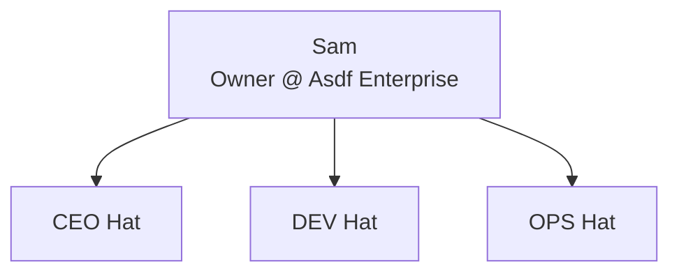
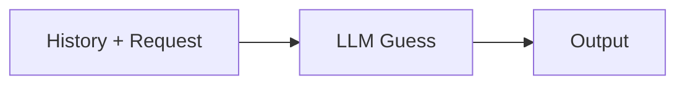
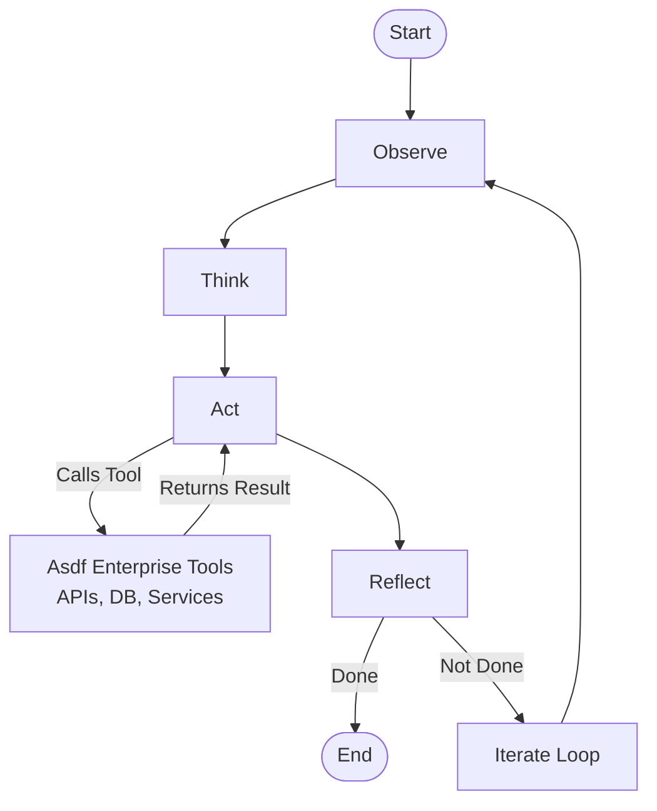
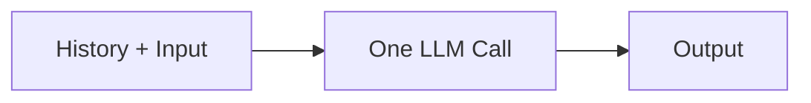
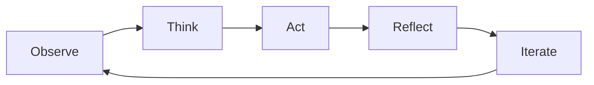
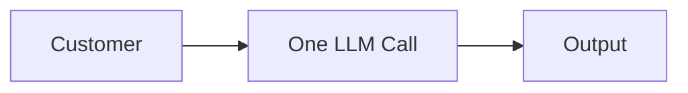
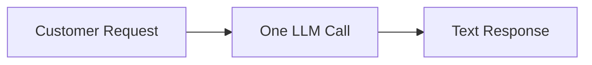
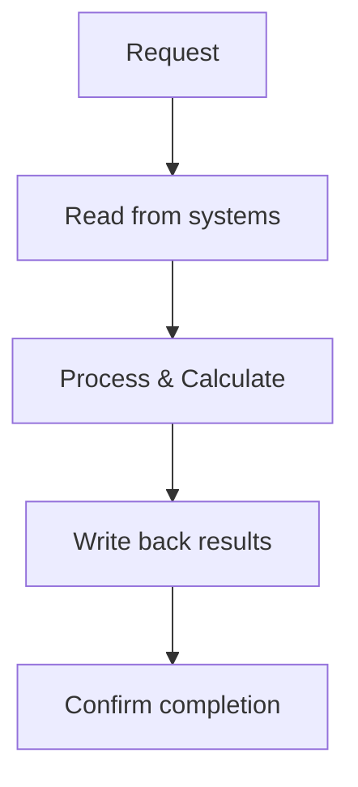

# Start With First Agentic Design Patterns  
## Chapter 1 — Agents are more than LLM chatbots.  
### Featuring: The Owner Who Wears All the Hats

---

## The Launch of Asdf Enterprise's "First Agent"

At **Asdf Enterprise Inc.**, Sam is "The Owner."

Not just in the cap table sense. In the "if anything breaks, it's Sam's problem" sense.

On Monday morning, Sam's role looks like this:



Sometimes Sam is:

- Pitching Asdf Enterprise's vision to customers (CEO hat)  
- Debugging deployment scripts (Dev/Ops hat)  
- Arguing with themselves about pricing (CEO vs CFO hat)  
- Answering support tickets (Support hat)  

Then the world starts yelling:

> "Agents are the future."  
> "Agents can automate everything."  
> "Your SaaS needs agents or you'll be left behind."

Sam nods.  
If *anything* can take hats off their head, they're in.

So Sam decides:

> "Asdf Enterprise Inc. is going to ship its first **agentic feature** this month."

Sam opens their editor. They're not a rookie; they know LLMs need context. Sam puts on the **Developer Hat** and crafts Asdf Enterprise's first "agent" with a proper message history:

```ts
const response = await llm.chat({
  messages: [
    { role: "system", content: "You are a helpful expert agent." },
    ...sessionHistory, // Look! It has memory!
    { role: "user", content: currentRequest }
  ]
});
```

Sam nods. "It has memory. It has a system prompt. It's basically AGI."

Sam integrates it with the UI, launches as:

> **Asdf Autonomous Analyst™**

Then, with the **CEO Hat** on, Sam hits deploy.

It's live.

---

## The First Real Customer Request

A paying customer logs into Asdf Enterprise and types:

> "Analyze our top three logistics vendors, compare risks (cost, reliability, contract terms),  
> and draft a recommendation for Q3 renewals."

The Asdf Autonomous Analyst™ (a very confident chatbot with history) responds:

> "Based on general logistics principles, you should look for reliability and low cost. I recall you mentioned vendors earlier, but I cannot see their current contracts. Here is a generic template for a renewal."

Sam stares at it.
It remembers the customer *mentioned* vendors.
But it didn't *check* the database. It didn't *calculate* the risks.
It just... chatted.

The customer replies:

> "It's not doing what it's supposed to. It's just talking at me."

Sam's hats all slide 15 degrees to the side.

Sam puts on the **Developer Hat** and thinks:

> "Okay, maybe the system prompt isn't strict enough. It needs to know it's an *analyst*, not a chat buddy."

Sam tweaks:

- "You are a senior logistics analyst."
- "Use data from the conversation history precisely."
- "Think step by step."
- "OUTPUT MUST BE ACTIONABLE."

Sam redeploys.
New request.
New answer:

> "I have analyzed the conversation history. Since I cannot access real-time contract data, I recommend you manually review the top 3 vendors for risk factors such as..."

Same vibe. New seasoning, same soup.
It remembers the past, but it can't *act* on the present.

After a few hours of this, Sam realizes:

> "This isn't an agentic system.
> This is just a **chatbot with a diary** wearing an 'agent' sticker."

That's the moment Sam's journey—and this book—begins.

---

## What You'll Learn in This Chapter

In this chapter, you'll see:

- Why Asdf Enterprise's first "agent" was just a **one-shot agent**  
- Why one-shot agents **fail** when tasks get real  
- Why prompt tweaking couldn’t fix it  
- The **difference between a one-shot agent and a real agent**  
- Why, as a builder, one must think in **loops, tools, and design**, not just "better prompts"  

The core idea:

> **A chatbot with history can remember everything you said.  
> It can even sound intelligent. But memory isn't agency. Action is.  
> Real agents do work through a loop: Observe → Think → Act → Reflect → Iterate.**

---

## One-Shot Agent vs Real Agentic System

### 1. What Sam Asked the Code Generator For

When Sam built the "agent," they gave it:
- A system prompt ("You are helpful")
- A history array (`[user, ai, user...]`)

Sam expected:
- something that *uses* that history to make decisions
- something that can look up *new* info to fill gaps
- something that behaves like an intelligent worker

In other words, Sam wanted a **real agentic system**.

### 2. What Sam Actually Got

Most modern chat implementations may give you this pattern (its getting better day by day too but let take this example):

```ts
// ┌───────────────────────────────┐
// │  Asdf Autonomous Analyst v0.1 │
// └───────────────────────────────┘
async function runAnalystAgent(userInput: string, history: Message[]): Promise<string> {
  const messages = [
    { role: "system", content: "You are an expert analyst agent..." },
    ...history,
    { role: "user", content: userInput }
  ];

  const result = await llm.chat(messages);
  return result.text;
}
```

That’s it.

- One prompt (with some history)
- One LLM call
- One answer 

This is a **stateful chatbot**, not an agent.

Visually:



No loop.
No tools.
No self-checks.
No ability to pause, look something up, and try again.

### 3. What Sam *Actually* Needed

A **real agentic system** at Asdf Enterprise should do something closer to:

1. **Observe** the request + context + prior knowledge  
2. **Think** about what steps are needed  
3. **Act** by calling tools / APIs / data sources  
4. **Reflect** on whether the result is good enough  
5. **Iterate** until done or constraints are met

Visually:



A real agentic system thinks before acting, uses tools, reflects, and iterates.

---

## Visual Steps for Sam — Understanding the Problem Clearly

### Step 1 — Draw What Sam Actually Shipped



### Step 2 — Label It Honestly

```
Asdf Autonomous Analyst v0.1 = Chatbot with Context
```

### Step 3 — Ask What the Customer Actually Needed

They needed:

- Data retrieval  
- Risk comparison logic  
- Business reasoning  
- Structured output  

### Step 4 — Sketch What a Real Agent Would Need



---

## Questions & Exercises (For the Reader)

### Quick Reality Check

```ts
async function runAnalystAgent(input, history) {
  return llm.chat([...history, input]);
}
```

Is this:

- A real agent?
- A chatbot?

### Why Didn’t Prompt Tuning Work?

Because telling a chatbot to "be more agentic" doesn't give it hands (tools) or a brain loop (reasoning). It just makes it a more confident talker.

### Mini Exercise

Write the honest label:

```
Asdf Enterprise Feature X is currently a __________.
```

---

## Patterns & Best Practices

### Pattern: Name Things Honestly  
If it’s one-shot, call it one-shot. Expectations matter.

### Pattern: Design Before You Prompt  
What tools? What steps? What logic? What constraints?

### Pattern: Think in Loops  

If this isn’t present, you don’t have agentic behavior.

---

## Anti-Patterns — What Asdf Enterprise Used to Do

### The Magic Prompt Fallacy

```
"You are the world's greatest autonomous agent!!! 
You have perfect memory of our conversation!!!
Do everything perfectly!!!"
```

Still just a chatbot. Memory ≠ Agency.

### The Prompt Spiral  
Adjectives don't fix missing architecture.

### Selling Autonomy Without Architecture  
If the system is:



…it is **not autonomous**.

---

## Case Study: The Asdf Autonomous Analyst Launch

### The Launch

**Product:** Asdf Autonomous Analyst™  
**Promise:** "Your AI coworker that remembers everything, learns from conversations, and works 24/7"  
**Initial Reception:** Positive feedback on conversation quality and memory

Sam launched with confidence. The agent had context. It had memory. It sounded intelligent.

### The Reality Check

**Timeline:** Within 2 weeks  
**Support Tickets:** Escalated from 0 to 23  
**Common Complaint:** "It's not doing what it's supposed to"

### Root Cause Analysis

Sam investigated the most critical failures:

| Customer Request | Agent Behavior | What Was Missing |
|------------------|----------------|------------------|
| "Update vendor database based on our emails" | Described what *should* be updated | Tool to execute database writes |
| "Pull Q3 sales data and create analysis" | Gave generic advice about Q3 trends | Tool to query actual data sources |
| "Draft contract, check legal template, send to vendor" | Created a generic template | Tools to access docs, validate, and send email |

**Pattern Identified:** The agent could **discuss** work but couldn't **do** work.

### Failed Remediation Attempts

Sam tried iterating on the system prompt:

1. **Attempt:** "You MUST take action, not just discuss actions"  
   **Result:** Agent claimed it did things, but nothing happened

2. **Attempt:** Add step-by-step examples in the prompt  
   **Result:** Agent described the steps beautifully, still didn't execute

3. **Attempt:** ALL CAPS EMPHASIS  
   **Result:** More confident responses, zero actual actions

**Diagnosis:** Prompt engineering cannot solve an architecture problem.

### The Breakthrough: The Whiteboard Moment

After exhausting prompt iterations, Sam drew two diagrams side-by-side:

**What Was Actually Built:**



**What Customers Actually Needed:**



### The Realization

Sam wrote on the whiteboard:

> **"We built a chat interface, not a worker."**
> 
> **"No amount of prompt engineering can give it hands."**

The gap was clear:
- ❌ No tools to **act** on systems
- ❌ No loop to **iterate** on mistakes
- ❌ No checks to **reflect** on quality

### The Solution Architecture

Sam sketched what a real agentic system needs:


**Core Requirements:**
- **Tools** to act on databases, APIs, and services
- **Memory** to learn from past interactions
- **Reflection** to validate outputs before returning
- **Iteration** to retry and improve

This diagram became **Asdf Enterprise's North Star**.

### Retrospective: What We Learned

**What Went Wrong:**
- Mistook "context window" for "agency"
- Assumed prompts could replace architecture
- Shipped before understanding the difference between chatbots and agents

**What Changed:**
- Committed to full architectural redesign
- Stopped prompt iteration, started systems design
- Defined clear requirements: tools, loops, and evaluation

**The Commitment:**

Sam announced at an all-hands meeting:

> "We're not shipping 'better prompts.' We're redesigning the entire system.  
> From one-shot chatbot to real agentic architecture.  
> This is going to take time. But we're doing it right."

---

### What Happened Next

That whiteboard diagram became the blueprint for Asdf Enterprise's transformation.

The rest of this book documents that journey: from one-shot failure to real agentic systems that actually work.

**Chapter 2** shows how Sam and the team redefined what an agent *actually is*—and built their first real one.

---

# End of Chapter 1  
